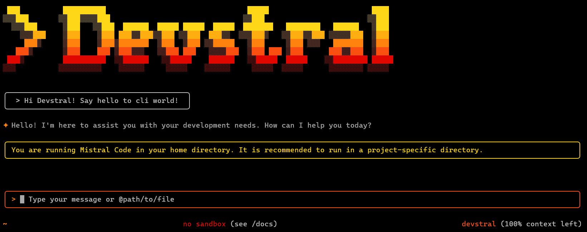

# Mistral Code



Mistral Code is a command-line AI workflow tool adapted from [**Gemini CLI**](https://github.com/google-gemini/gemini-cli) and [**Qwen Code**](https://github.com/QwenLM/qwen-code) (Please refer to [this document](./README.gemini.md) for more details), optimized for [Devstral](https://mistral.ai/news/devstral-2507) models.

## Key Features

- **Code Understanding & Editing** - Query and edit large codebases beyond traditional context window limits
- **Workflow Automation** - Automate operational tasks like handling pull requests and complex rebases
- **Enhanced Parser** - Adapted parser specifically optimized for Qwen-Coder models

## Quick Start

### Prerequisites

Ensure you have [Node.js version 20](https://nodejs.org/en/download) or higher installed.

```bash
curl -qL https://www.npmjs.com/install.sh | sh
```

### Installation

You can install it from source:

```bash
git clone https://github.com/Wylgrif/Mistral-code.git
cd mistral-code
npm install
npm install -g .
```
Then run from anywhere:

```bash
mistral
```

### API Configuration

Set your Mistral API key (In Mistral Code project, you can also set your API key in `.env` file). the `.env` file should be placed in the root directory of your current project.

```bash
export OPENAI_API_KEY="your_api_key_here"
export OPENAI_BASE_URL="your_inference_provider"
export OPENAI_MODEL="your_ai_model"
```
example with ollama:
```bash
export OPENAI_API_KEY="ollama"
export OPENAI_BASE_URL="http://localhost:11434/v1/"
export OPENAI_MODEL="devstral"
```
*Note*: Use the `setx` command in Windows cmd.

*Note*: You must have [Ollama](https://ollama.com/download) and [Devstral](https://ollama.com/library/devstral) installed on your computer to use this configuration.

## Usage Examples

### Explore Codebases

```sh
cd your-project/
mistral
> Describe the main pieces of this system's architecture
```

### Code Development

```sh
> Refactor this function to improve readability and performance
```

### Automate Workflows

```sh
> Analyze git commits from the last 7 days, grouped by feature and team member
```

```sh
> Convert all images in this directory to PNG format
```

## Popular Tasks

### Understand New Codebases

```text
> What are the core business logic components?
> What security mechanisms are in place?
> How does the data flow work?
```

### Code Refactoring & Optimization

```text
> What parts of this module can be optimized?
> Help me refactor this class to follow better design patterns
> Add proper error handling and logging
```

### Documentation & Testing

```text
> Generate comprehensive JSDoc comments for this function
> Write unit tests for this component
> Create API documentation
```


## Project Structure

```
Mistral-code/
├── packages/           # Core packages
├── docs/              # Documentation
├── examples/          # Example code
└── tests/            # Test files
```

## Development & Contributing

See [CONTRIBUTING.md](./CONTRIBUTING.md) to learn how to contribute to the project.

## Troubleshooting

If you encounter issues, check the [troubleshooting guide](docs/troubleshooting.md).

## Acknowledgments

This project is based on [Google Gemini CLI](https://github.com/google-gemini/gemini-cli). We acknowledge and appreciate the excellent work of the Gemini CLI team. Our main contribution focuses on parser-level adaptations to better support Qwen-Coder models.

## License

[LICENSE](./LICENSE)
